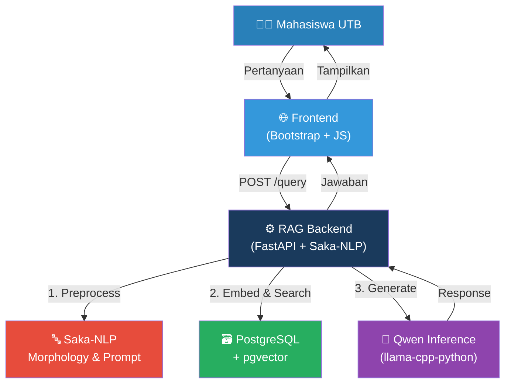
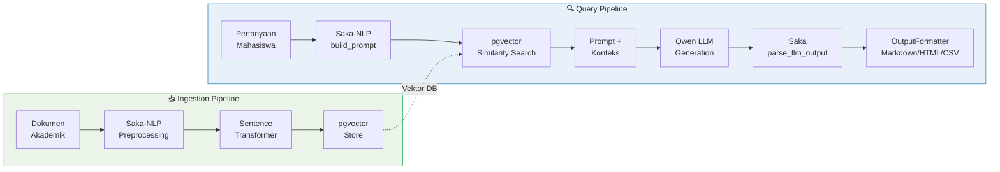
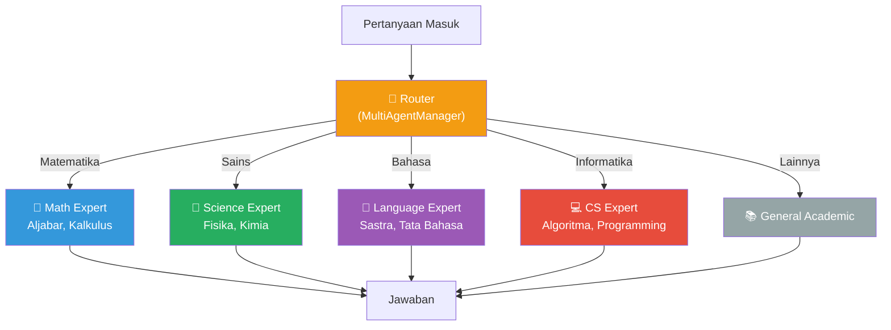
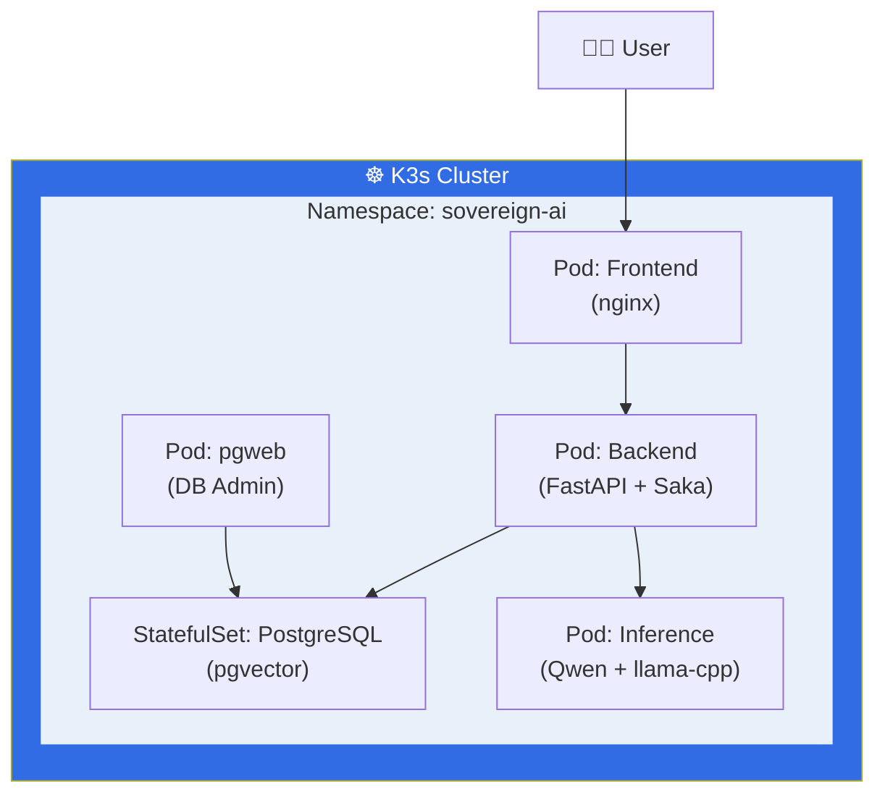

# Sovereign AI: Orchestrating Private LLM Workloads on Kubernetes

---

## 📅 Sesi Teknis: End-to-End Pipeline RAG Privat
**Membangun Asisten Akademik UTB Teknik Informatika**
**Dengan Saka-NLP & K3s**

---

## 1. Tantangan AI di Institusi Pendidikan
- **Privasi Data**: Data riset dan akademik sangat sensitif.
- **Kedaulatan Data**: Mengapa harus bergantung pada API pihak ketiga?
- **Nuansa Bahasa**: LLM global gagal menangkap morfologi Bahasa Indonesia.

---

## 2. Arsitektur "Sovereign AI"

### Diagram Arsitektur Utama


---

## 3. Pipeline RAG Detail

### Diagram Alur Data


---

## 4. Multi-Agent System

### Diagram Routing Multi-Agent


---

## 5. Saka-NLP Features

### 5.1 Structured Prompt (`build_prompt`)
```python
prompt = build_prompt(
    role="Asisten Akademik Virtual",
    task="Menjawab pertanyaan berdasarkan konteks dokumen.",
    constraint="Jawab HANYA dari konteks...",
    output_contract={"jawaban": "...", "referensi": ["..."]},
    fallback_rule="Minta upload dokumen jika tidak ada konteks.",
    input_data=f"Konteks:\n{context}\n\nPertanyaan: {query}"
)
```

### 5.2 Template Prompt
```python
t = PromptTemplate("Pelajaran: {{mapel}} | Level: {{level}}")
print(t.render(mapel="Matematika", level="SMA"))
```

### 5.3 Multi-Agent
```python
mgr = MultiAgentManager()
mgr.add_agent("math_expert", "Guru Matematika", "Bantu soal aljabar...")
router_prompt = mgr.route_prompt(query)
```

### 5.4 Output Formatting
```python
OutputFormatter.format(data, "markdown")  # html, csv, table
```

---

## 6. Deployment Stack

### Diagram Kubernetes


---

## 7. Stack Teknologi

| Komponen      | Teknologi             | Fungsi                          |
| ------------- | --------------------- | ------------------------------- |
| **NLP**       | Saka-NLP              | Prompt, morphology, multi-agent |
| **Database**  | PostgreSQL + pgvector | Vector storage                  |
| **DB Admin**  | pgweb                 | Web UI PostgreSQL               |
| **Inference** | llama-cpp-python      | Serving Qwen GGUF               |
| **Model**     | Qwen 2.5 (1.5B/3B)    | SLM generation                  |
| **Frontend**  | HTML + Bootstrap      | UI Mahasiswa                    |
| **Runtime**   | K3s                   | Lightweight Kubernetes          |
| **Container** | Docker Compose        | Local development               |

---

## 8. Demo Langsung 🎬

```bash
# Jalankan semua service
docker-compose up --build

# Akses:
# Frontend:  http://localhost:3000
# Backend:   http://localhost:8080/docs
# PGWeb:     http://localhost:8081
# Inference: http://localhost:8000
```

---

## 9. Kesimpulan
- ✅ **Privat**: Data tidak pernah meninggalkan infrastruktur UTB.
- ✅ **Cerdas**: Multi-Agent + Saka-NLP untuk konteks Indonesia.
- ✅ **Scalable**: Cloud-native, siap K3s/Kubernetes.
- ✅ **Efisien**: SLM Qwen + GGUF = resource rendah.

---

## Tanya Jawab (Q&A)
**Terima Kasih!**

📦 Repository: [github.com/...](https://github.com/...)
📚 Saka-NLP: [github.com/Muhammad-Ikhwan-Fathulloh/Saka-NLP](https://github.com/Muhammad-Ikhwan-Fathulloh/Saka-NLP)
